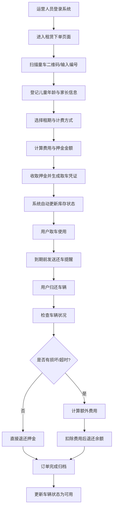

# 童车租赁管理系统 - 产品需求文档 (PRD)

## 1. 产品概述

童车租赁 Web 应用是面向商场、景区和亲子馆运营人员的专业童车借还管理平台，旨在通过数字化手段提升童车租赁运营效率，降低管理成本，改善亲子出行体验。

- **核心价值**：一站式管理童车库存、租赁流程、会员体系、财务结算、车辆运维和数据分析
- **目标用户**：商场运营管理员、景区租赁服务人员、亲子馆前台接待
- **解决痛点**：人工盘点效率低、押金结算易出错、车辆状态跟踪困难、运营数据不透明

## 2. 核心功能

### 2.1 用户角色

| 角色 | 说明 | 核心权限 |
|------|------|----------|
| 运营管理员 | 总部/门店管理者 | 全部功能权限、数据导出、报表查看 |
| 前台操作员 | 门店日常操作人员 | 租赁下单、归还确认、会员登记、异常处理 |
| 运维人员 | 车辆维护清洁人员 | 车辆维护、清洁安排、损坏记录 |

### 2.2 功能模块

1. **库存看板**：点位余量概览、车型筛选、实时库存状态、地图分布视图
2. **租赁下单**：扫码建单、儿童年龄登记、租期设置、押金收取、订单延长
3. **会员管理**：会员列表、会员标签、消费记录、取还提醒推送
4. **押金结算**：押金收取/退还、超时费用计算、结算明细、收入导出
5. **车辆维护**：车辆状态管理、损坏记录、冻结/解冻、清洁排班
6. **异常处理**：超时未还、车辆丢失、损坏索赔、争议工单
7. **报表中心**：周转率分析、丢失率统计、热门时段、日/周/月报表

### 2.3 页面详情

| 页面名称 | 模块名称 | 功能描述 |
|---------|---------|---------|
| 库存看板 | 点位卡片 | 展示各点位车辆总数、可用数、待维护数、使用中数量 |
| 库存看板 | 车型筛选 | 按童车类型（轻便型/标准型/双胞胎型/电动型）筛选库存 |
| 库存看板 | 状态分布 | 饼图/环形图展示各状态车辆占比 |
| 库存看板 | 实时监控 | 车辆使用状态实时更新，低库存预警提示 |
| 租赁下单 | 扫码建单 | 扫描车辆二维码/输入编号快速创建订单 |
| 租赁下单 | 信息登记 | 儿童年龄、家长联系方式、证件信息录入 |
| 租赁下单 | 租期配置 | 按小时/按天选择，自定义起止时间 |
| 租赁下单 | 押金支付 | 支持多种支付方式，生成支付凭证 |
| 租赁下单 | 订单延长 | 续租操作，费用差价计算 |
| 会员管理 | 会员列表 | 分页展示会员信息，支持多条件搜索 |
| 会员管理 | 会员标签 | VIP/常客/新手/黑名单等标签管理 |
| 会员管理 | 消费记录 | 历史订单、消费金额、租赁频次统计 |
| 会员管理 | 消息提醒 | 取车提醒、还车倒计时、优惠活动推送 |
| 押金结算 | 结算列表 | 待结算、已结算、异常结算单分类展示 |
| 押金结算 | 超时计费 | 阶梯超时费率自动计算，支持自定义规则 |
| 押金结算 | 退款操作 | 原路退还押金，扣除相应费用 |
| 押金结算 | 导出明细 | Excel/CSV 格式导出收入明细报表 |
| 车辆维护 | 车辆档案 | 车辆基本信息、采购日期、累计使用时长 |
| 车辆维护 | 损坏记录 | 损坏部位、程度、维修费用、维修状态 |
| 车辆维护 | 状态管理 | 可用/维护中/已冻结/已报废状态切换 |
| 车辆维护 | 清洁排班 | 清洁计划、清洁人员、清洁记录 |
| 异常处理 | 异常工单 | 异常类型、上报时间、处理状态、优先级 |
| 异常处理 | 超时追踪 | 超时未还车辆定位、联系记录、上报流程 |
| 异常处理 | 丢失登记 | 丢失车辆信息、报案记录、理赔进度 |
| 异常处理 | 损坏索赔 | 定损金额、索赔记录、支付状态 |
| 报表中心 | 周转率 | 日周转率、周周转率、车型周转率对比 |
| 报表中心 | 丢失率 | 月度丢失率、点位丢失率对比趋势图 |
| 报表中心 | 热门时段 | 24小时热力图、高峰时段分析 |
| 报表中心 | 收入统计 | 日收入、押金沉淀、超时费收入趋势 |

## 3. 核心流程

### 租赁主流程

### 车辆维护流程

## 4. 用户界面设计

### 4.1 设计风格

- **设计理念**：专业高效、清爽明亮的企业级后台管理风格，兼顾亲和力（亲子主题）
- **主色调**：温暖珊瑚橙 `#FF6B6B` 作为主色（活力、亲子感），搭配深青蓝 `#1F4E5F` 作为辅色（专业、信任）
- **中性色**：主背景 `#F7F9FC`，卡片背景 `#FFFFFF`，文字主色 `#2D3748`，次要文字 `#718096`
- **强调色**：成功 `#10B981`，警告 `#F59E0B`，错误 `#EF4444`，信息 `#3B82F6`
- **按钮风格**：圆角 8px，中等高度 40px，主按钮渐变填充，次按钮描边样式
- **字体方案**：标题使用 `Noto Sans SC`（思源黑体）粗体，正文使用系统字体栈，数字使用等宽字体增强可读性
- **布局风格**：左侧导航栏 + 顶部状态栏 + 主内容区三栏式，卡片化模块布局
- **图标风格**：线性图标（Lucide），24px 尺寸，统一描边宽度
- **圆角规范**：卡片圆角 12px，弹窗圆角 16px，标签圆角 20px

### 4.2 页面设计概览

| 页面名称 | 模块名称 | UI 元素 |
|---------|---------|---------|
| 库存看板 | 顶部概览 | 4 个 KPI 统计卡（渐变背景 + 大数字 + 趋势箭头） |
| 库存看板 | 点位网格 | 3 列响应式卡片，包含状态色条、进度条、操作按钮 |
| 库存看板 | 图表区域 | 左侧状态分布环形图，右侧车型分布柱状图 |
| 库存看板 | 筛选栏 | 顶部筛选芯片组（Chip），支持多条件组合 |
| 租赁下单 | 步骤指示器 | 顶部 4 步进度条（扫码→登记→确认→完成） |
| 租赁下单 | 信息表单 | 分组表单卡片，左侧图标标签，右侧输入控件 |
| 租赁下单 | 费用概览 | 右侧浮动费用明细卡，实时计算汇总 |
| 会员管理 | 数据表格 | 斑马纹表格，头像列、标签列、操作下拉菜单 |
| 会员管理 | 搜索过滤 | 顶部搜索框 + 标签筛选面板 |
| 押金结算 | 结算列表 | Tab 切换分类，卡片式结算单，进度条展示结算状态 |
| 押金结算 | 超时计算器 | 交互式时间滑块，费率阶梯表 |
| 车辆维护 | 时间线 | 维护历史时间线视图，状态节点图标 |
| 异常处理 | 看板视图 | 按状态分列的看板（待处理→处理中→已解决），支持拖拽 |
| 报表中心 | 多图表组合 | 折线图、面积图、热力图、数据透视表 |

### 4.3 响应式设计

- **优先模式**：桌面端优先设计（1440px 基准），适配 1024px 及以上分辨率
- **平板适配**：1024px-1280px，左侧导航收起为图标模式，网格从 3 列变为 2 列
- **交互优化**：表格支持水平滚动，按钮最小触控区域 40×40px，关键操作设置点击反馈动画
- **打印优化**：报表页提供打印样式，隐藏导航和操作按钮

### 4.4 动效与微交互

- **页面加载**：骨架屏占位 → 内容淡入（200ms ease-out）
- **卡片悬停**：轻微上浮（translateY -2px）+ 阴影加深（200ms）
- **数据刷新**：数字滚动动画（count-up），图表渐进式绘制
- **状态变更**：Toast 通知从右侧滑入，成功/警告/错误不同色
- **按钮反馈**：按下时 scale(0.97) 缩放，loading 状态旋转图标
