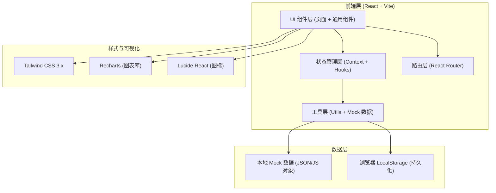

# 童车租赁管理系统 - 技术架构文档

## 1. 架构设计



## 2. 技术选型说明

| 技术栈 | 版本 | 用途说明 |
|--------|------|---------|
| React | 18.x | 核心 UI 框架，使用 Hooks + 函数组件 |
| Vite | 5.x | 构建工具，提供快速开发体验和 HMR |
| React Router Dom | 6.x | 前端路由管理，SPA 多页面导航 |
| Tailwind CSS | 3.x | 原子化 CSS 框架，快速构建界面 |
| Recharts | 2.x | 数据可视化图表库，支持折线/柱状/饼图/热力图 |
| Lucide React | 0.x | 现代化线性图标库，统一风格 |
| JavaScript | ES2022 | 使用原生 JS，避免 TS 额外复杂度（演示项目） |

**设计原则**：
- 前后端分离架构，本项目为纯前端演示，使用 Mock 数据模拟后端响应
- 组件化开发，按页面/通用/布局分类组织
- 响应式设计，桌面优先，兼容平板
- 无外部后端依赖，可独立运行

## 3. 路由定义

| 路由路径 | 页面名称 | 说明 |
|---------|---------|------|
| `/` | 库存看板 | 首页，点位余量概览、车型筛选、状态分布图表 |
| `/inventory` | 库存看板 | 同首页，完整路径别名 |
| `/rental` | 租赁下单 | 扫码建单、信息登记、租期配置、押金支付 |
| `/members` | 会员管理 | 会员列表、标签管理、消费记录、消息提醒 |
| `/settlement` | 押金结算 | 结算列表、超时计费、退款操作、导出明细 |
| `/maintenance` | 车辆维护 | 车辆档案、损坏记录、状态管理、清洁排班 |
| `/exceptions` | 异常处理 | 异常工单、超时追踪、丢失登记、损坏索赔 |
| `/reports` | 报表中心 | 周转率、丢失率、热门时段、收入统计 |

## 4. 目录结构

```
src/
├── main.jsx              # 应用入口
├── App.jsx               # 根组件（路由配置 + 布局）
├── index.css             # 全局样式 + Tailwind 入口
├── assets/               # 静态资源
├── components/           # 通用组件
│   ├── Layout/           # 布局组件（侧边栏、顶部栏）
│   ├── UI/               # 基础 UI（Button、Card、Modal、Table 等）
│   └── Charts/           # 图表封装组件
├── pages/                # 页面组件
│   ├── Inventory.jsx     # 库存看板
│   ├── Rental.jsx        # 租赁下单
│   ├── Members.jsx       # 会员管理
│   ├── Settlement.jsx    # 押金结算
│   ├── Maintenance.jsx   # 车辆维护
│   ├── Exceptions.jsx    # 异常处理
│   └── Reports.jsx       # 报表中心
├── context/              # 全局状态
│   └── AppContext.jsx    # 共享状态（库存、订单、会员等）
├── data/                 # Mock 数据
│   ├── mockInventory.js  # 库存/点位数据
│   ├── mockOrders.js     # 订单数据
│   ├── mockMembers.js    # 会员数据
│   ├── mockVehicles.js   # 车辆数据
│   └── mockReports.js    # 报表统计数据
└── utils/                # 工具函数
    ├── formatters.js     # 金额、日期、百分比格式化
    ├── calculators.js    # 费用、超时、周转率计算
    └── constants.js      # 常量定义（车型、状态、费率）
```

## 5. 数据模型定义

### 5.1 实体关系图 (ERD)

```mermaid
erDiagram
    VEHICLE ||--o{ RENTAL_ORDER : "被租赁"
    MEMBER ||--o{ RENTAL_ORDER : "发起租赁"
    LOCATION ||--o{ VEHICLE : "存放于"
    RENTAL_ORDER ||--o| SETTLEMENT : "关联结算"
    RENTAL_ORDER ||--o{ MAINTENANCE_RECORD : "触发维护"
    RENTAL_ORDER ||--o| EXCEPTION_TICKET : "可能产生异常"
    MEMBER ||--o{ MEMBER_TAG : "拥有标签"

    VEHICLE {
        string id PK "车辆编号"
        string model "车型"
        string location_id FK "所属点位"
        string status "状态"
        date purchase_date "采购日期"
        int usage_hours "累计使用时长"
    }

    LOCATION {
        string id PK "点位编号"
        string name "点位名称"
        string type "点位类型(商场/景区/亲子馆)"
        string address "地址"
        int capacity "容量"
    }

    MEMBER {
        string id PK "会员ID"
        string name "姓名"
        string phone "手机号"
        date join_date "注册日期"
        int total_rentals "租赁次数"
        decimal total_spent "累计消费"
    }

    RENTAL_ORDER {
        string id PK "订单号"
        string vehicle_id FK "车辆编号"
        string member_id FK "会员ID"
        datetime start_time "取车时间"
        datetime end_time "预计还车时间"
        datetime actual_return "实际还车时间"
        decimal deposit "押金"
        decimal rental_fee "租金"
        decimal overtime_fee "超时费"
        string status "订单状态"
    }

    SETTLEMENT {
        string id PK "结算单号"
        string order_id FK "订单号"
        decimal total_amount "应收总额"
        decimal refund_amount "退还押金"
        string pay_method "支付方式"
        date settle_date "结算日期"
        string status "结算状态"
    }

    MAINTENANCE_RECORD {
        string id PK "维护ID"
        string vehicle_id FK "车辆编号"
        string type "类型(维修/清洁)"
        string description "描述"
        decimal cost "费用"
        date date "维护日期"
        string staff "维护人员"
    }

    EXCEPTION_TICKET {
        string id PK "工单号"
        string order_id FK "订单号"
        string type "异常类型"
        string priority "优先级"
        string status "处理状态"
        date create_time "创建时间"
        date resolve_time "解决时间"
    }

    MEMBER_TAG {
        string id PK "标签ID"
        string member_id FK "会员ID"
        string tag "标签名"
        string color "标签颜色"
    }
```



### 5.2 车型与费率常量

```javascript
// 车型定义
export const VEHICLE_MODELS = [
  { code: 'LIGHT', name: '轻便型', deposit: 200, hourlyRate: 15, dailyRate: 80, color: '#3B82F6' },
  { code: 'STANDARD', name: '标准型', deposit: 300, hourlyRate: 20, dailyRate: 100, color: '#10B981' },
  { code: 'TWIN', name: '双胞胎型', deposit: 500, hourlyRate: 30, dailyRate: 150, color: '#F59E0B' },
  { code: 'ELECTRIC', name: '电动型', deposit: 800, hourlyRate: 50, dailyRate: 260, color: '#8B5CF6' },
];

// 车辆状态
export const VEHICLE_STATUS = {
  AVAILABLE: { code: 'AVAILABLE', name: '可用', color: '#10B981', bgColor: '#D1FAE5' },
  IN_USE: { code: 'IN_USE', name: '使用中', color: '#3B82F6', bgColor: '#DBEAFE' },
  MAINTENANCE: { code: 'MAINTENANCE', name: '维护中', color: '#F59E0B', bgColor: '#FEF3C7' },
  FROZEN: { code: 'FROZEN', name: '已冻结', color: '#6B7280', bgColor: '#F3F4F6' },
  SCRAPPED: { code: 'SCRAPPED', name: '已报废', color: '#EF4444', bgColor: '#FEE2E2' },
};

// 超时费率（阶梯式）
export const OVERTIME_RULES = [
  { threshold: 30, unit: '分钟', rate: 0, description: '30分钟内免超时费' },
  { threshold: 60, unit: '分钟', rate: 20, description: '30-60分钟收20元' },
  { threshold: 120, unit: '分钟', rate: 40, description: '1-2小时收40元' },
  { threshold: 240, unit: '分钟', rate: 80, description: '2-4小时收80元' },
  { threshold: Infinity, unit: '分钟', rate: 120, description: '4小时以上收120元封顶' },
];
```

## 6. 全局状态管理

使用 React Context 集中管理共享状态，避免多层 props 传递：

```javascript
// AppContext 状态结构
{
  // 数据
  locations: [],          // 点位列表
  vehicles: [],           // 车辆列表
  orders: [],             // 订单列表
  members: [],            // 会员列表
  settlements: [],        // 结算单
  exceptions: [],         // 异常工单
  maintenance: [],        // 维护记录
  
  // 当前筛选条件
  filters: {
    vehicleModel: null,
    locationId: null,
    status: null,
    dateRange: null,
  },
  
  // 操作方法
  actions: {
    createOrder(),        // 创建租赁订单
    extendOrder(),        // 延长租期
    returnVehicle(),      // 确认归还
    settlePayment(),      // 结算押金
    updateVehicleStatus(), // 更新车辆状态
    createException(),    // 创建异常工单
    addMemberTag(),       // 添加会员标签
    exportReport(),       // 导出报表
  }
}
```

## 7. 核心功能实现思路

### 7.1 费用计算逻辑
- 基础租金 = min(小时数 × 小时单价, 日封顶价)
- 超时费按阶梯规则计算，取最高适用档
- 实际退还 = 押金 - 基础租金 - 超时费 - 损坏赔偿

### 7.2 周转率计算
- 日周转率 = 当日使用车辆数 / 总车辆数 × 100%
- 车型周转率 = 某车型当日使用次数 / 该车型总量

### 7.3 热门时段热力图
- 数据结构：24小时 × 7天 二维数组
- 渲染方式：Recharts Heatmap，颜色深浅代表租赁频次
